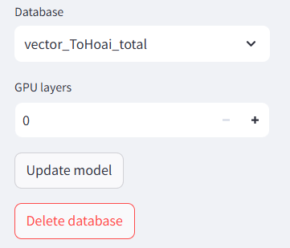

# AI search PDF tool
In this project, I use RAG to create a tool where you put your PDF files and then we can ask information about these files.

Embedding model: [GPT4all](https://api.python.langchain.com/en/latest/embeddings/langchain_community.embeddings.gpt4all.GPT4AllEmbeddings.html) of langchain

LLM model: [vinallama-7b-chat](https://huggingface.co/vilm/vinallama-7b-chat-GGUF)

## Setup enviroment
Create enviroment:
```
python -m ven ./my_venv
```

Active enviroment:
```
cd my_venv
Scripts\activate
```

## Install requirment packages
Choose the appropriate torch version from [website](https://pytorch.org/)

Example:
```
pip install torch torchvision torchaudio --index-url https://download.pytorch.org/whl/cu118
```
Install required packages:
```
pip install -r requirements.txt
````

## Prepare model
Download model [vinallama-7b-chat-GGUF](https://huggingface.co/vilm/vinallama-7b-chat-GGUF/resolve/main/vinallama-7b-chat_q5_0.gguf?download=true).

Then you move it to folder models.


## Terminal interface
If you want to save GPU from streamlit app, you can use terminal
```
python main.py
```

## Run app
```
streamlit run app_streamlit.py
```

## Instruction manual
### Question and answer.
Choose your 'database' and 'gpu layers' you want. Then press "Update model" button to load model with database.


Now you can ask some questions about information in database which you created from PDF files.


### Create database.
Before you ask anything in PDF files, you need to create database from these files.

First, upload your PDF files.


Then, name the database vector and press "Create database" button.


Wait for a minutes. You can see the notification about successful or fail create database.


Now you can choose another vector database or reload to update system and you can see this vector database you create.


## Delete database
You choose a database and press the "Delete database button".



If succesful, you can see the notification


## Error
### On terminal
If you look similar error, please reduce the number of GPU layers
```
CUDA error 2 at D:\a\ctransformers\ctransformers\models\ggml\ggml-cuda.cu:6413: out of memory
```
### On app


If you see the APP is break and the text "CONNECTING" in the upper right corner, please run app again and choose a smaller number  of GPU layers